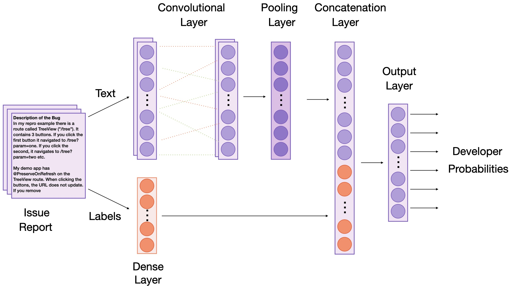
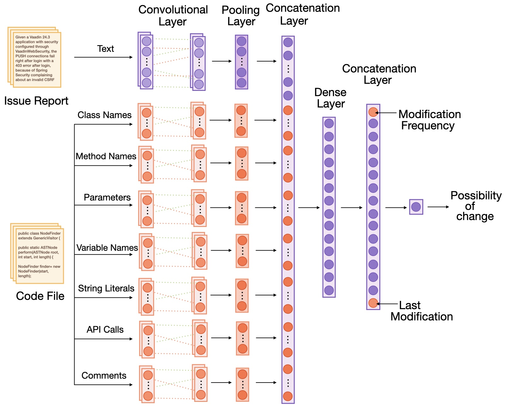

# ML-Based Issue Management System

This project was developed as part of a bachelor thesis. It focuses on automating issue assignment and localization using machine learning to streamline software maintenance workflows.

## Overview

The system retrieves data from GitHub repositories, processes it to prepare training datasets, and trains models for issue assignment and localization. It includes modules for data collection, preprocessing, model training, and evaluation.

## Project Structure

Below is a brief description of the files and directories included in the project:

- **`.env`**
  Contains the GitHub API token used for accessing repository data.

- **`fetch_data.py`**
  Downloads issues and pull requests from a specified GitHub repository.
  Extracts relationships between pull requests, related issues, and developers, and saves this information as JSON files.
  _Run this script first to collect the necessary data for model training._

- **`build_code_database.py`**
  Prepares data for the issue localization model:
  - Clones the specified repository
  - Scans the codebase to determine file change history
  - Collects and processes positive and negative samples per issue
  - Parses and vectorizes the data for the model

### Directories

- **`/lib`**
  Contains helper functions used throughout the project.

- **`/models`**
  Includes the machine learning models for issue assignment and localization.
  _Before running, ensure configuration parameters at the top of each file are set correctly._

- **`/data`**
  Stores raw and preprocessed data generated by `fetch_data.py` and `build_code_database.py`.

- **`/evaluation_results`** and **`/saved_models`**
  Automatically generated directories that store trained models and evaluation outputs.

- **`/comparison_datasets`**
  Contains two versions of the Eclipse/JDT dataset used for model comparison with other studies, as referenced in the thesis.

## Model Architectures

### Issue Assignment Model

### Issue Localization Model

